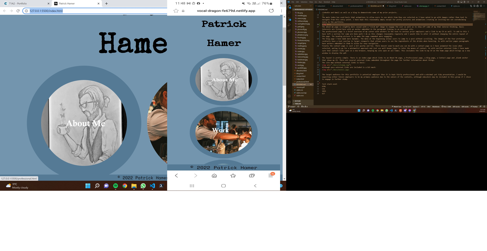
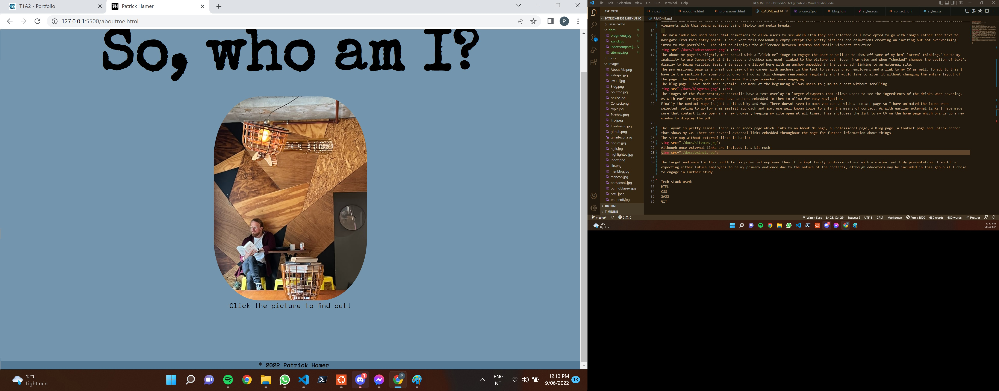
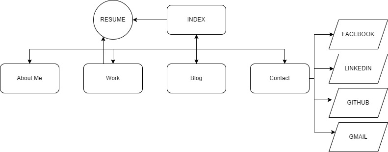
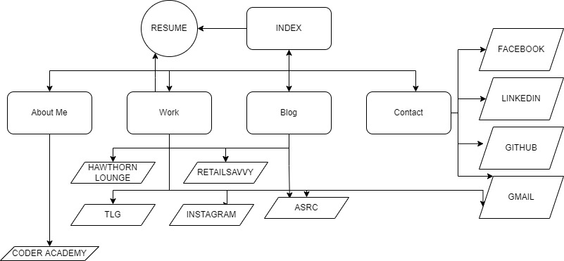

**README FOR PATRICK HAMER T1A2 PORTFOLIO**

The following is the required readme file for my T1A2 Portfolio. 
The Portfolio website can be found at:  
  
https://vocal-dragon-fe679d.netlify.app/  
  

or if you would like to check out my github repo please head to  
  
  https://github.com/Patrick655321/Patrick655321.github.io  
    
The purpose of this portfolio is to demonstrate what I have learned so far in the *Coder Academy* course while at the same time giving an example of who I am for future employers. To facilitate this there is a small 'about me' section which gives a basic run down of my hobbies and interests, a professional page that has a broad overview as well as a link to my current CV, a links page that allows users to contact me via Github, Facebook, Linkedin and Gmail as well as a blog to demonstrate some of my prior projects.  The page is designed to be responsive to phone, tablet and desktop sized viewports with this being achieved using flexbox and media breaks.
  
The main index has used basic html animations to allow users to see which item they are selected as I have opted to go with images rather than text to navigate from this entry point. I have kept this reasonably empty except for pretty pictures and animations creating an inviting but not overwhelming intro to the portfolio.  The picture displays the difference between Desktop and Mobile viewport structure.
  
The about me page is slightly more casual with a "click me" image to engage the user as well as to show off some of my html lateral thinking."Due to my inability to use Javascript at this stage a checkbox was used, linked to the picture but hidden from view and when *checked* changes the section of text's display to being visible. Basic interests are listed here with an anchor embedded in the paragraph linking to an external site. 
 
The professional page is a brief overview of my career with anchors in the text to various prior employers and a link to my CV as well. To add to this I have left a section for some pro bono work I do as this changes reasonably regularly and I would like to alter it without changing the entire layout of the page. The heading picture is to make the page somewhat more engaging.
The blog page I have made more dynamic. The menu at the beginning allows users to jump to a post without scrolling.
  
The images of the four prototype cocktails have a text overlay in larger viewports that allows users to see the ingredients of the drinks when hovering. As with earlier pages paragraphs have anchors embedded in them to allow for easy navigation.

Finally the contact page is just a bit quirky and fun. There doesnt seem to much you can do with a contact page so I have animated the icons when selected, opting to go for a minimalist approach and jsut use well known logos to infer the means of contact. As with earlier external links I have made sure that contact links open in a new browser, keeping my site open at all times. This includees the link to my CV on the home page which brings up a new window to display the pdf.  

The layout is pretty simple. There is an index page which links to an About Me page, a Professional page, a Blog page, a Contact page and _blank anchor that shows my CV. There are several external links embedded throughout the page for further information about things.
The site map without external links is basic:

Although once external links are included is a bit much:

The target audience for this portfolio is potential employer thus it is kept fairly professional and with a minimal yet tidy presentation. I would be expecting either future employers to be my primary audience due to the nature of the contents, although educators may be included in this group if I chose to engage in further study.

Tech stack used:
HTML
CSS
SASS 
GIT